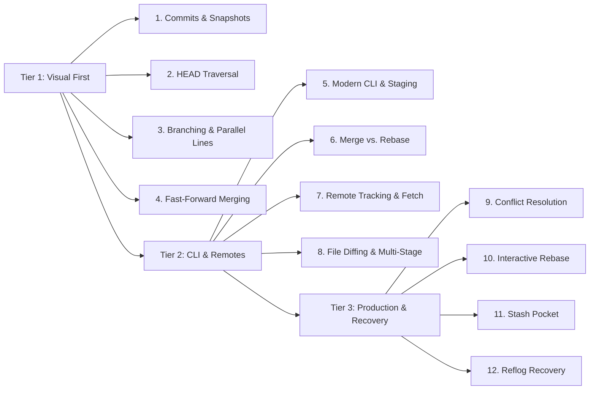
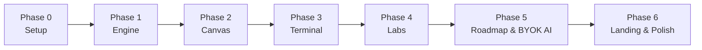

# Modern Fluid Git Visualizer & Learning Engine
## Master Product & Technical Architecture Specification

## 1. Executive Summary & Core Philosophy

The **Modern Fluid Git Visualizer** is a client-side, zero-latency Git simulation, inspection, and learning engine. It replaces static diagrams and rigid canvas repaints with a physics-driven, topological “flowing water” visual experience, combined with the clean pedagogical progression inspired by [roadmap.sh](https://roadmap.sh) while avoiding the cognitive clutter of traditional multi-panel tools.

```text
┌─────────────────────────────────────────────────────────────┐
│                 MODERN FLUID GIT VISUALIZER                 │
│                                                             │
│   ┌───────────────┐     ┌───────────────┐     ┌─────────┐   │
│   │ Working Tree  │ ──> │ Staging (Idx) │ ──> │ Commits │   │
│   └───────────────┘     └───────────────┘     └─────────┘   │
│           │                     │                  │        │
│           └─────────────────────┴──────────────────┘        │
│                                 │                           │
│                      Pure Git State Engine                  │
│                                 │                           │
│        ┌────────────────────────┼────────────────────┐      │
│        ▼                        ▼                    ▼      │
│  Physics Canvas           Interactive CLI       State Dash   │
│  (Framer Motion/SVG)      (Modern Syntax)      (Internals)  │
└─────────────────────────────────────────────────────────────┘
```

### 1.1 Key Principles & Anti-Overload Design

- **Progressive UI Disclosure (Anti-Clutter):** Rather than overwhelming learners with 5 dense panels at once, interface complexity unlocks progressively. Tier 1 displays only the Canvas and simple Action Buttons; the CLI unlocks in Tier 2; and Internals/Rebase Studios unlock in Tier 3.
- **Roadmap-Driven Progression:** Inspired by `roadmap.sh`, the curriculum is represented as an interactive visual node tree with glowing checkpoints, branching learning paths, and zero distraction.
- **State Before Syntax:** Users understand how data moves across the three trees (Working Tree → Staging Area → Repository Commit History) visually before memorizing CLI flags.
- **Continuous Topological Motion:** Nodes do not jump; branch lines bend, split, flow, and re-converge with mass and spring elasticity.
- **Bring-Your-Own-Key (BYOK) AI Architecture:** Ships with a free-tier default proxy, while enabling power users to plug in their own paid Gemini, OpenAI, or Anthropic API keys directly in the browser for deeper, unrestricted explanations.
- **Desktop-First Optimization:** Tailored for laptops and desktop workstations ($\ge 1024\text{px}$) where developers execute real Git workflows.

### 1.2 Competitive Analysis: Adopt vs. Avoid

The design of this application is informed by a deep analysis of existing Git learning tools. We adopt their strengths while deliberately avoiding their UX pitfalls.

#### What We Adopt (Best-in-Class Features)

| Feature (Source) | What It Does | Our Implementation |
|---|---|---|
| **Step-by-Step Animation Scrubber** (Gitualize) | Multi-step commands (merge, rebase) break down into pausable, rewindable animated phases. | `AnimationScrubber` component appears contextually only during multi-step operations. Hidden otherwise to maintain clean UI. |
| **Command Flag Option Visualizer** (Gitualize Live) | Visualizing sub-flags (e.g. `git add -A`, `git add -u`, `git add -p`, `git commit --amend`). | Interactive flag toggle dropdown in the Action Deck and Command Explorer to re-run simulations with different flag modifiers. |
| **3-Column Staging Metaphor** (Gitualize Live) | Clear visual separation: Working Directory (red) $\rightarrow$ Staging Area (green) $\rightarrow$ Repository Commits (blue). | Integrated into our Working Tree and Staging Area panels with animated particle/card translations between trees. |
| **Searchable Git Glossary A–Z** (Gitualize) | Built-in dictionary of Git terms with plain-language definitions. | On-demand slide-out `GlossaryDrawer` panel + inline hover tooltips on jargon terms throughout the app. |
| **Real-World Recipe Scenarios** (Gitualize) | Practical "I messed up, how do I fix it?" walkthroughs (wrong branch commit, amend message, partial staging). | Integrated into Roadmap as bonus challenge nodes between main curriculum levels. |
| **Interactive Diff View** (Gitualize) | Visual green `+` / red `-` line-by-line diff inspection before staging or committing. | `DiffInspector` modal that opens when clicking a file in the Staging Area or Working Tree panel. |
| **Side-by-Side Command Comparisons** (Gitualize Roadmap) | Visual comparison cards: `merge` vs `rebase`, `reset` vs `revert`, `restore` vs `checkout`. | `CommandComparison` split-view component accessible from the Command Explorer and embedded in relevant lessons. |
| **Visualization Accuracy** (Gitualize) | Simulated graph faithfully matches Git's real internal mechanics (SHA hashes, parent pointers, tree objects). | Engine generates deterministic simulated SHA-1 hashes with accurate parent chains, validated by compatibility test suite. |
| **Safety Classification Badges** (Gitualize) | Commands tagged as Safe 🟢, Caution 🟡, or Destructive 🔴. | Color-coded safety badges displayed in terminal autocomplete, Command Explorer, and lesson sidebars. |

#### What We Deliberately Avoid (UX Anti-Patterns)

| Anti-Pattern (Source) | Why It Hurts Beginners | Our Alternative |
|---|---|---|
| **Passive "Video-Player" Only Mode** (Gitualize Live) | Users can only watch pre-recorded animations by clicking "Play/Next". They cannot type real commands or experiment freely. | True Interactive Simulation: Users have a live interactive terminal CLI where they can type any custom Git command and watch their own repository react in real-time. |
| **Severe Scroll Fatigue (9,000px+ Pages)** (Gitualize Live) | Controls at the bottom, step tabs at top, and text in the middle require endless vertical scrolling per step. | Zero-Scroll Desktop Dashboard: Single-viewport workspace ($\ge 1024\text{px}$) where canvas, terminal, and goal objective fit without page scrolling. |
| **5-Panel Simultaneous Display** (Gitualize) | Canvas + Working Dir + Staging + Object Hex + Controls all visible from second one. Causes cognitive paralysis — beginners don't know where to look. | Progressive UI Disclosure: Tier 1 shows only Canvas + Action Buttons. Panels unlock gradually as concepts are introduced. |
| **No Guided "Start Here" Journey** (Gitualize) | Expects users to already know which command to search for. True beginners have no entry point. | Dedicated Landing Page with `[ Start Guided Roadmap ]` CTA launching Level 1 immediately. |
| **Heavy Jargon from Day 1** (Gitualize) | Terms like "Tree object", "Blob", "Detached HEAD", "SHA-1 hash" appear before users understand what a commit is. | Plain-language tooltips and progressive terminology introduction. Technical terms are hidden in Tier 1 and introduced with visual context in Tier 2+. |
| **Rigid Box Layouts vs Fluid Springs** (Gitualize Live) | Rigid square boxes and snapping cards feel dated and static. | Fluid topological physics: SVG cubic Bézier curves that bend, stretch, and flow with mass and spring elasticity. |
| **Forced Login Wall** (Roadmap.sh Live) | Forces users into a login/OAuth popup when clicking "Done" to save progress. | 100% Zero-Login Local Storage: Progress saves instantly to `localStorage` with JSON export/import portability. |
| **No AI Assistance** (Gitualize / Roadmap.sh) | When stuck, users must leave the tool entirely to Google for help. | Built-in BYOK AI Coach with on-demand hints and automatic passive assistance after 3 failed attempts. |

---

## 2. System Architecture & Boundaries

```text
┌─────────────────────────────────────────────────────────────────────────┐
│                               USER INTERFACE LAYER                       │
│  ┌───────────────────────────────────────────────────────────────────┐  │
│  │     Roadmap Navigation & Progressive Disclosure Layout Manager    │  │
│  └───────────────────────────────────────────────────────────────────┘  │
│  ┌───────────────────────┐  ┌───────────────────────┐  ┌─────────────┐  │
│  │ Flowing Motion Canvas │  │ Terminal Emulator CLI  │  │ Action Deck │  │
│  └───────────────────────┘  └───────────────────────┘  └─────────────┘  │
│  ┌───────────────────────────────────────────────────────────────────┐  │
│  │      State Dashboard & Dynamic Internals Drawer (Unlocked in T3)  │  │
│  └───────────────────────────────────────────────────────────────────┘  │
│  ┌───────────────────────────────────────────────────────────────────┐  │
│  │       Landing Page Hero, BYOK Settings Modal & AI Coach Pill      │  │
│  └───────────────────────────────────────────────────────────────────┘  │
└────────────────────────────────────┬────────────────────────────────────┘
                                     │ Dispatches Actions / Commands
                                     ▼
┌─────────────────────────────────────────────────────────────────────────┐
│                           SIMULATOR STATE ENGINE                         │
│  ┌────────────────────────┐  ┌───────────────────────┐  ┌────────────┐  │
│  │ Command Lexer & Parser │  │ Working Tree & Index  │  │ Object DB  │  │
│  └────────────────────────┘  └───────────────────────┘  └────────────┘  │
│  ┌────────────────────────┐  ┌───────────────────────┐  ┌────────────┐  │
│  │ Ref & HEAD Controller  │  │ Dual-State (Local/Rem)│  │ Reflog/Undo│  │
│  └────────────────────────┘  └───────────────────────┘  └────────────┘  │
│  ┌────────────────────────┐  ┌───────────────────────┐  ┌────────────┐  │
│  │ Pedagogical Interceptor│  │ Conflict & Merge Sim  │  │ Stash Area │  │
│  └────────────────────────┘  └───────────────────────┘  └────────────┘  │
└────────────────────────────────────┬────────────────────────────────────┘
                                     │ Emits DAG & Event Streams
                                     ▼
┌─────────────────────────────────────────────────────────────────────────┐
│                          PERSISTENCE & EXTENSIONS                       │
│  ┌──────────────────┐  ┌─────────────────────┐  ┌────────────────────┐  │
│  │ LocalStorage DB  │  │ BYOK AI Gateway     │  │ JSON Export/Import │  │
│  │ (State + Keys)   │  │ (Gemini/OpenAI/Anth)│  │ (Zero Login)       │  │
│  └──────────────────┘  └─────────────────────┘  └────────────────────┘  │
└─────────────────────────────────────────────────────────────────────────┘
```

### 2.1 Real Git vs. Simulator Scope

#### Simulated
- The DAG (Directed Acyclic Graph) of commits, tree objects, and blob hashes.
- `HEAD`, branch pointers, detached `HEAD` states, tag references, and remote-tracking references (`origin/main`).
- Working Tree modifications, index/staging states, and untracked files.
- Three-way merges, fast-forwards, rebase replays, conflict blocks, stashing, and reflog histories.
- Simulated remote fetch and push synchronizations.

#### Omitted (with Pedagogical Explanations)
- Byte-for-byte packfile indexing.
- Custom hook execution pipelines.
- Network-level socket protocols (SSH/HTTPS handshakes).
- Raw binary diffing engines.

---

## 3. Data Structures & State Persistence

### 3.1 Core State Schema (TypeScript)

```ts
export type ObjectId = string; // Simulated SHA-1 hash, e.g. 'a1b2c3d'

export interface GitBlob {
  id: ObjectId;
  type: 'blob';
  content: string;
}

export interface GitTreeEntry {
  mode: '100644' | '040000';
  path: string;
  id: ObjectId;
  type: 'blob' | 'tree';
}

export interface GitTree {
  id: ObjectId;
  type: 'tree';
  entries: Record<string, GitTreeEntry>;
}

export interface GitCommit {
  id: ObjectId;
  type: 'commit';
  tree: ObjectId;
  parents: ObjectId[];
  author: { name: string; email: string; timestamp: number };
  message: string;
}

export interface DiffHunk {
  id: string;
  header: string; // e.g. '@@ -1,4 +1,6 @@'
  oldStart: number;
  oldLines: number;
  newStart: number;
  newLines: number;
  lines: Array<{
    type: 'add' | 'delete' | 'context';
    content: string;
    oldLineNumber?: number;
    newLineNumber?: number;
  }>;
  isStaged: boolean;
}

export interface FileState {
  path: string;
  content: string; // Canonical committed version
  stage: 'untracked' | 'modified' | 'staged' | 'committed' | 'conflicted';
  stagedContent?: string;
  worktreeContent?: string;
  hunks?: DiffHunk[]; // Pre-computed hunks for O(1) line-by-line interactive staging (git add -p)
}

export interface ReflogEntry {
  id: string;
  oldTarget: ObjectId | null;
  newTarget: ObjectId;
  command: string;
  message: string;
  timestamp: number;
}

export interface StashEntry {
  id: string;
  message: string;
  indexTree: ObjectId;
  workTree: ObjectId;
  baseCommit: ObjectId;
  timestamp: number;
}

export interface GitRepositoryState {
  objects: Record<ObjectId, GitBlob | GitTree | GitCommit>;
  refs: {
    heads: Record<string, ObjectId>;
    tags: Record<string, ObjectId>;
    remotes: Record<string, Record<string, ObjectId>>;
  };
  head: {
    type: 'branch' | 'detached';
    target: string;
  };
  workingTree: Record<string, FileState>;
  stagingArea: Record<string, ObjectId>;
  stash: StashEntry[];
  reflog: Record<string, ReflogEntry[]>;
  conflicts: Record<string, { base: string; ours: string; theirs: string }>;
}

export type AiProvider = 'default-free' | 'google-gemini' | 'openai' | 'anthropic';

export interface UserAiSettings {
  provider: AiProvider;
  customApiKey?: string;
  customModel?: string; // e.g. 'gemini-2.5-pro', 'gpt-4o', 'claude-3-7-sonnet'
}

export interface AppPersistedState {
  version: '1.0.0';
  activeLessonId: string | null;
  completedLessonIds: string[];
  selectedTheme: string;
  aiSettings: UserAiSettings;
  unlockedPanels: {
    terminal: boolean;
    stagingInspector: boolean;
    internalsInspector: boolean;
    stashPocket: boolean;
    rebaseStudio: boolean;
  };
  savedPlaygroundState?: GitRepositoryState;
}
```

### 3.2 State Persistence & Storage Management

- **Storage Key:** `GIT_FLOW_STATE_V1` stored in browser `localStorage`.
- **API Key Security:** Custom user API keys are strictly retained in client-side memory/localStorage and are **never** transmitted to or logged by intermediate proxy servers.
- **Storage Limit Fallback ($5\text{MB}$ Cap):** If `QuotaExceededError` triggers, historical reflog snapshots are automatically pruned while maintaining curriculum progress and user keys.
- **Export & Import JSON:** Dedicated modal with single-click JSON download/upload to seamlessly transfer learning history, unlocked badges, and sandbox repositories across devices.

---

## 4. Visual Motion Engine & Design System

### 4.1 Animation Semantics & Dynamic Visual Grammar

| Git operation | Visual metaphor and spatial motion | Duration / physics curve |
|---|---|---|
| `git commit` | Node expands from parent along rail; branch line extends smoothly. | Spring: stiffness 140, damping 12 |
| `git switch` | Floating `HEAD` ring glides across paths with a particle tracer. | Eased cubic Bézier: `(0.4, 0, 0.2, 1)` |
| `git merge` | Diverged branches spawn dynamic Bézier bridge curves converging at a merge node. | Multi-phase: Bridge → Node → Label |
| `git rebase` | Commits detach, elevate, drift horizontally, and attach with glowing new hashes. | Stepwise sequential ripple: 150 ms per commit |
| `git reset` | Pointer snaps backward along history; dangling nodes fade into ghost mode. | Immediate snappy spring: stiffness 220 |
| `git stash` | Modified files fold down and drop into the slide-out Stash Pocket. | Gravity-like downward translation |
| `git cherry-pick` | Commit clone creates a glowing duplicate and slides into the target branch tip. | Parabolic leap curve |
| `git fetch` | Remote reference nodes advance smoothly along dashed background tracks. | Eased translation with pulse glow |

### 4.2 Multi-Step Animation Scrubber

For complex multi-phase operations (`merge`, `rebase`, `cherry-pick`), the canvas displays a contextual **Animation Scrubber** toolbar:

```text
┌────────────────────────────────────────────────────────────────┐
│ ⏮  ◀  Step 2 of 4: Compare branch heads  ▶  ⏭  ▌▌ Pause     │
│ ━━━━━━━━━━━━━━━━━━━━━━━━━━●━━━━━━━━━━━━━━━━━━━━━━━━━━━━━━━━ │
│ 1. Find ancestor  →  2. Compare heads  →  3. Apply  →  4. Done│
└────────────────────────────────────────────────────────────────┘
```

- **Visibility Rule:** Only appears during multi-step operations. Hidden during simple single-step commands (`commit`, `switch`, `add`) to maintain a clean canvas.
- **Controls:** Step backward, step forward, play/pause, and drag scrubber to any phase.
- **Phase Labels:** Each step has a plain-English description (e.g., "Finding the common ancestor of main and feature").

### 4.3 Deterministic Rail & Lane Allocation

- **Primary trunk:** `main`/`master` always locks to Lane 0, the center spine.
- **Branch lanes:** Calculated through topological level ordering. Feature branches increment lanes outwards: `+1, -1, +2, -2`.
- **Remote tracks:** Rendered as secondary, dashed translucent rails alongside local branch lanes.
- **Edge splines:** Rendered as cubic SVG Bézier curves:

$$C(t) = (1-t)^3P_0 + 3(1-t)^2tP_1 + 3(1-t)t^2P_2 + t^3P_3$$

### 4.4 Design Tokens & Themes

All visual elements leverage CSS custom properties configured for low eye strain, refined contrast, and elegant developer aesthetics (avoiding harsh, glaring neon):

| Theme Token | Midnight Slate (Default) | Tokyo Night | Nord Frost | Catppuccin Mocha | Vesper Dark |
|---|---|---|---|---|---|
| `--bg-base` | `#0b0f17` | `#1a1b26` | `#242933` | `#1e1e2e` | `#101010` |
| `--bg-surface` | `#141c2b` | `#24283b` | `#2e3440` | `#313244` | `#1a1a1a` |
| `--text-primary` | `#e2e8f0` | `#c0caf5` | `#eceff4` | `#cdd6f4` | `#ffffff` |
| `--text-muted` | `#64748b` | `#565f89` | `#7b88a1` | `#a6adc8` | `#8a8a8a` |
| `--branch-main` | `#38bdf8` (Soft Sky) | `#7aa2f7` (Slate Blue) | `#88c0d0` (Nord Frost) | `#89b4fa` (Soft Blue) | `#ffc799` (Warm Amber) |
| `--branch-feat` | `#a78bfa` (Soft Violet) | `#bb9af7` (Muted Purple)| `#b48ead` (Muted Rose) | `#cba6f7` (Mauve) | `#a0a0a0` (Muted Silver) |
| `--node-border` | `#334155` | `#414868` | `#434c5e` | `#45475a` | `#282828` |
| `--accent-warm` | `#fbbf24` (Subtle Gold) | `#e0af68` (Warm Ochre) | `#ebcb8b` (Soft Yellow)| `#f9e2af` (Pale Cream) | `#ff9e64` (Soft Peach) |

### 4.5 Unique Visual Identity: "Fluid Slate with Purpose-Driven Glow"

To ensure the application looks distinct and modern without visual fatigue, glowing and neon effects are **used purposefully as functional indicators rather than constant background noise**:

```text
┌────────────────────────────────────────────────────────────────┐
│                   PURPOSE-DRIVEN GLOW ENGINE                   │
│                                                                │
│  [ Calm Slate Base ]         ──>  Deep, comfortable backdrop   │
│  [ Frosted Glass Docks ]     ──>  Low-contrast panels & cards  │
│  [ Tasteful Neon Highlights] ──>  Reserved ONLY for actions:   │
│                                   • Active HEAD pointer ring   │
│                                   • Newly created commit pulse │
│                                   • Active branch tip badge    │
│                                   • Merge conflict warning     │
└────────────────────────────────────────────────────────────────┘
```

1. **Restrained, Purpose-Driven Glows:**
   - Glow effects are never used as static wallpaper. They activate dynamically to draw the eye to important events:
     - The **`HEAD` cursor ring** has a soft luminous beacon so learners never lose track of where they are.
     - A **newly created commit** emits a brief, 400ms expansion pulse before settling into a clean state.
     - **Merge conflict blocks** glow with a warm amber warning indicator until resolved.
2. **Organic Fluid Splines vs. Rigid Boxes:**
   - Branches curve and flow smoothly with mass and spring elasticity, using refined pastel accents instead of loud, blinding colors.
3. **Muted Frosted Glass Depth:**
   - Subtle `backdrop-filter: blur(12px)` with low-opacity borders (`rgba(255, 255, 255, 0.05)`), creating clean hierarchy without visual noise.
4. **Developer-Grade Typography:**
   - Headings & UI: Clean modern sans (`Inter` / `Geist`).
   - Terminal & Code: Crisp developer monospace (`JetBrains Mono` / `Fira Code`) with subtle syntax highlighting.
5. **Restrained Micro-Animations:**
   - Smooth position springs, gentle hover elevations, and quiet checkmark badges on level completion.

---

## 5. UI Architecture: Progressive Disclosure & Roadmap Interface

### 5.1 Landing Page Experience (`/`)

1. **Hero Section:**
   - Headline: *"Master Git Through Physics-Driven Fluid Visuals."*
   - Subtitle: *"Stop memorizing abstract CLI commands. See commits flow, branches branch, and merges resolve in real-time."*
   - Interactive Hero Preview: A live, interactive mini-canvas showcasing an automated animated merge/rebase loop.
   - Primary CTA: `[ Start Guided Roadmap ]` (Launches Tier 1 Level 1).
   - Secondary CTA: `[ Open Freeform Sandbox ]` (Launches empty interactive playground).
2. **Interactive Visual Roadmap Tree (Roadmap.sh Style):**
   - Visual nodes depicting the learning journey with branching tracks (Fundamentals $\rightarrow$ Branching $\rightarrow$ Conflict Mastery $\rightarrow$ Recovery).
   - Dynamic progress indicators displaying completed levels, active checkpoint, and unlocked badges.
   - **Node Click $\rightarrow$ Slide-Out Drawer (`RoadmapNodeDrawer`):** Clicking any roadmap node opens a right-side drawer (while gently dimming background) containing:
     - Clear concept summary & learning objectives.
     - `[ 🚀 Launch Interactive Level ]` button that transitions directly into the simulator.
     - Embedded AI Tutor action: `[ 🤖 Explain in Plain English ]`.
     - Status switcher: `[ Learning 🟡 ]` `[ Done 🟢 ]` `[ Skip ⚪ ]`.
   - **Zero-Login Advantage:** Unlike roadmap.sh which forces users to sign in via GitHub/Google to mark progress, our app saves all progress instantly to `localStorage` without any authentication wall.
   - Bonus recipe scenario nodes ("I committed to the wrong branch", "Fix a typo in my last commit") between main levels.
3. **Anti-Clutter Comparison Showcase:** Highlights how the app teaches step-by-step without overwhelming the learner with 5 panels simultaneously.

### 5.2 Progressive UI Disclosure Levels

```text
┌────────────────────────────────────────────────────────────────────────┐
│ TIER 1 (Zero-Syntax Visual Mode)                                      │
│ ┌────────────────────────────────────────────────────────────────────┐ │
│ │ Top Bar: Level Objective & Progress Tracker                         │ │
│ ├────────────────────────────────────────────────────────────────────┤ │
│ │ Fluid SVG Canvas (Focus on Commits & Pointers)                     │ │
│ ├────────────────────────────────────────────────────────────────────┤ │
│ │ Action Deck Buttons: [ Create Commit ] [ New Branch ] [ Switch ]   │ │
│ └────────────────────────────────────────────────────────────────────┘ │
└────────────────────────────────────────────────────────────────────────┘

┌────────────────────────────────────────────────────────────────────────┐
│ TIER 2 (CLI & Staging Unlocked)                                        │
│ ┌──────────────────────────────────┬─────────────────────────────────┐ │
│ │ Top Bar + State Dashboard Pill   │ Staging Area Inspector (Compact)│ │
│ ├──────────────────────────────────┴─────────────────────────────────┤ │
│ │ Fluid SVG Canvas                                                   │ │
│ ├──────────────────────────────────┬─────────────────────────────────┤ │
│ │ Interactive Terminal CLI         │ Action Deck / Command Hints     │ │
│ └──────────────────────────────────┴─────────────────────────────────┘ │
└────────────────────────────────────────────────────────────────────────┘

┌────────────────────────────────────────────────────────────────────────┐
│ TIER 3 (Full Professional Suite Unlocked)                              │
│ ┌──────────────────────────────────┬─────────────────────────────────┐ │
│ │ Full State & Internals Bar       │ Remote Track / Stash Pocket     │ │
│ ├──────────────────────────────────┴─────────────────────────────────┤ │
│ │ Fluid SVG Canvas (Multi-rail + Remote origin/main)                  │ │
│ ├──────────────────────────────────┬─────────────────────────────────┤ │
│ │ Interactive Terminal CLI         │ Interactive Rebase / Conflict Lab│ │
│ └──────────────────────────────────┴─────────────────────────────────┘ │
└────────────────────────────────────────────────────────────────────────┘
```

---

## 6. Pedagogical Engine, Interceptor & Bring-Your-Own-Key AI Coach

### 6.1 Command Interceptor & Pedagogical Guidance

Every CLI input routes through a syntax classifier:

1. **Supported Commands:** Mutate the simulated repository state in `GitReducer`.
2. **Simulated Informational Commands:** Output formatted Git terminal text (`git status`, `git log --graph`, `git diff`).
3. **Pedagogical Redirection:** When a student enters a valid Git command that doesn't advance the current lesson goal (e.g. creating a branch without switching), the command executes cleanly and displays an actionable educational tip.
4. **Unsupported / Remote Boundary Handling:** Returns a clear notice explaining the local simulator's scope and directing users to relevant curriculum levels.
5. **Safety Classification Badges:** Every command in autocomplete and the Command Explorer displays a safety rating:
   - 🟢 **Safe:** `switch`, `status`, `log`, `diff`, `branch`, `stash`, `tag`.
   - 🟡 **Caution:** `merge`, `rebase`, `pull`, `commit --amend`, `revert`.
   - 🔴 **Destructive:** `reset --hard`, `clean -fd`, `push --force`, `branch -D`.

### 6.2 Searchable Git Glossary

- **On-Demand Drawer:** A slide-out `GlossaryDrawer` panel accessible via a `[ 📖 Glossary ]` button in the top navigation bar.
- **Inline Hover Tooltips:** Throughout the app, Git jargon terms (HEAD, detached HEAD, fast-forward, upstream, blob, tree, reflog) are underlined with a dashed style. Hovering displays a concise plain-English tooltip with a mini animation.
- **Search:** Full-text search across all glossary entries.
- **Progressive Visibility:** In Tier 1, only basic terms (commit, branch, HEAD) appear. Advanced terms (blob, tree object, reflog, upstream) are introduced alongside their relevant Tier 2/3 lessons.

### 6.3 Interactive Diff Inspector

- **Trigger:** Clicking any file entry in the Working Tree or Staging Area panel opens the `DiffInspector` modal.
- **Display:** Standard unified diff format with green `+` additions and red `-` deletions, with line numbers.
- **Selective Staging:** Users can click individual hunks or lines to stage selectively (simulating `git add -p` behavior).

### 6.4 Command Comparison Explorer

A dedicated view accessible from the navigation bar and embedded within relevant curriculum levels:

| Comparison | Visual Explanation |
|---|---|
| `git merge` vs. `git rebase` | Split-screen animation: left shows merge commit topology, right shows linear rebase replay. |
| `git reset` vs. `git revert` | Left shows pointer moving backward with ghost nodes; right shows new inversion commit appended. |
| `git restore` vs. `git checkout --` | Side-by-side file content restoration vs. legacy syntax equivalent. |
| `git switch` vs. `git checkout` | Modern vs. legacy syntax with identical HEAD movement animation. |

### 6.5 Bring-Your-Own-Key (BYOK) Multi-Provider AI Coach & Serverless Proxy

```text
┌────────────────────────────────────────────────────────────────────────┐
│                   SECURE AI GATEWAY ARCHITECTURE                       │
│                                                                        │
│   ┌──────────────────────────────────────────────────────────────┐     │
│   │ Client Browser (AiCoachPill / Settings)                      │     │
│   │ • Default Mode: Zero Key (Uses Free Gemini Serverless Proxy) │     │
│   │ • BYOK Mode: Passes custom key via encrypted request header  │     │
│   └──────────────────────────────┬───────────────────────────────┘     │
│                                  │ POST /api/ai-coach                  │
│                                  │ (Headers: x-custom-api-key, provider)
│                                  ▼                                     │
│   ┌──────────────────────────────────────────────────────────────┐     │
│   │ Next.js Serverless Route Gateway (/api/ai-coach/route.ts)    │     │
│   │ • Solves Browser CORS Blocks (OpenAI & Anthropic CORS fix)   │     │
│   │ • Validates payload & streams response to client             │     │
│   │ • Zero server logging of custom keys                         │     │
│   └──────────────────────┬───────────────┬───────────────────────┘     │
│                          │               │                             │
│                          ▼               ▼                             │
│                  ┌───────────────┐ ┌───────────────┐ ┌───────────────┐ │
│                  │ Google Gemini │ │ OpenAI GPT-4o │ │ Claude 3.7    │ │
│                  └───────────────┘ └───────────────┘ └───────────────┘ │
└────────────────────────────────────────────────────────────────────────┘
```

- **CORS Architecture Fix:** OpenAI and Anthropic strictly block direct browser `fetch()` requests via CORS policies. Both Default Mode and BYOK Mode route through our Next.js backend (`/api/ai-coach/route.ts`). In BYOK mode, the client passes the user's custom API key in the `x-custom-api-key` header; the server route makes the server-to-server call, streams the response, and never logs or persists the key.
- **Trigger Conditions:**
  - *On-Demand:* Clicking `[ Ask AI Coach ]` or `[ Why did this command fail? ]`.
  - *Passive Assistance:* Automatically surfaces a discreet coaching hint after 3 consecutive failed attempts at a lesson objective.
- **Context Payload Transmitted:**
  ```json
  {
    "currentCommand": "git merge feature",
    "errorMessage": "Merge conflict in index.ts",
    "repoSnapshot": {
      "branches": ["main", "feature"],
      "head": "main",
      "staging": [],
      "conflicted": ["index.ts"]
    },
    "levelObjective": "Fast-forward merge feature into main"
  }
  ```
- **Tiered AI Response Capabilities:**
  - **Default Free Mode:** 2-sentence conversational card explaining the immediate failure reason and next command to try.
  - **BYOK Paid Mode:** In-depth diagnosis, interactive multi-step scenario walk-throughs, custom repository breakdown, and unlimited queries without rate-limits.
- **Settings Modal Integration:**
  - Simple dropdown: `Default (Free)` | `Google Gemini` | `OpenAI` | `Anthropic`.
  - Secure password-masked input for custom API keys stored exclusively in browser `localStorage`.

### 6.6 Sandbox Enhancements, Shareability & Developer Power Tools

```text
┌────────────────────────────────────────────────────────────────┐
│                    DEVELOPER POWER TOOLS                       │
│                                                                │
│  [ 📦 Playground Presets ]   ──>  1-Click Scenario Templates   │
│  [ 🔗 URL Hash Sharing ]     ──>  Instant Zero-Backend Share   │
│  [ 📸 SVG/PNG Image Export ] ──>  Copy Tree Image to Clipboard │
│  [ ↩️ Visual Undo/Redo ]     ──>  Ctrl+Z / Ctrl+Y with Springs │
│  [ ⚡ Command Palette ]       ──>  Cmd/Ctrl+K Quick Launcher    │
│  [ 🔊 Tactile Sound FX ]     ──>  Subtle Audio Clicks (Muted)  │
└────────────────────────────────────────────────────────────────┘
```

1. **Pre-Built Sandbox Scenarios:**
   - Instead of starting from an empty state, users can load curated sandbox templates:
     - `Diverged Feature Branch`: Ready for testing `merge` vs `rebase`.
     - `Pending Merge Conflict`: Pre-configured 3-way conflicting files ready for `ConflictResolver`.
     - `Detached HEAD State`: Ready to test commit creation and rescue branches.
     - `Messy History`: 5 cluttered commits ready for squash rebase.
2. **URL Hash Graph Sharing & Security Sanitization:**
   - **Strict Data Sanitization (Security Guarantee):** The serialization engine strictly extracts ONLY pure repository DAG state (`Pick<GitRepositoryState, 'objects' | 'refs' | 'head' | 'workingTree' | 'stagingArea'>`). All user settings, curriculum progress, and custom API keys are **strictly excluded and stripped** before LZ-compression to prevent accidental key exposure.
   - **Zero-Backend Sharing:** The sanitized payload is LZ-compressed and placed in the URL hash (`#graph=...`).
   - **Export Image:** Generates a crisp SVG or PNG of the current commit tree with one-click "Copy to Clipboard" or "Download".
3. **Visual Undo / Redo (`Ctrl+Z` / `Ctrl+Y`):**
   - Pure state snapshot ring buffer enabling instant rollback and forward-replay with reverse topological spring animations.
4. **Global Command Palette (`Cmd/Ctrl+K` or `?`):**
   - Raycast-style modal for rapid navigation across the 12 levels, instant glossary search, and theme switching.
5. **Tactile Sound Effects (Muted by Default):**
   - Web Audio API synthesizer generating subtle, high-frequency mechanical clicks on commit creation and branch merges (toggleable with persistent mute state in `localStorage`).

---

## 7. Complete Interactive Curriculum



### Tier 1: Visual First — Zero Syntax Barrier
- **Level 1: Snapshots in Time:** Creating commits, understanding SHA hashes and sequential lineage.
- **Level 2: The Observer (`HEAD`):** Moving `HEAD` to inspect older commits without mutating files.
- **Level 3: Parallel Realities:** Branch creation, visual branching splits, and pointer isolation.
- **Level 4: Rejoining Streams:** Fast-forward merges where branch pointers slide forward smoothly.

### Tier 2: CLI Transition, Branching Strategies & Remotes
- **Level 5: Modern CLI:** `git switch -c`, `git add`, and `git commit -m` workflows.
- **Level 6: Merge vs. Rebase:** Three-way merge commits vs. linear rebase history.
- **Level 7: Remote Tracking & Fetch:** Dual-state local vs. `origin/main` tracks; simulating `git fetch` and `git push`.
- **Level 8: Staging & Restoration:** Working Tree vs. index, selective staging, and `git restore --staged`.

### Tier 3: Production Scenarios & Panic Recovery
- **Level 9: Conflict Resolution:** Visual three-way merge conflict resolver with conflict-marker blocks.
- **Level 10: Interactive Rebase Studio:** Drag-and-drop studio for squash, reorder, pick, drop, and edit operations.
- **Level 11: Stash Pocket:** Preserving uncommitted local work while switching context to a hotfix.
- **Level 12: Reflog & Orphan Recovery:** Rescuing lost commits after accidental `git reset --hard HEAD~3`.

---

## 8. Accessibility, Performance & Quality Standards

### 8.1 Accessibility (a11y)
- **Keyboard Navigation:** Arrow keys pan the canvas; `+`/`-` keys control zoom level; `Tab` cycles focus through interactive commit nodes and branch pointers.
- **Screen Reader Announcements (`aria-live="polite"`):** Live region announces all repository state mutations.
- **Focus Management:** Modals (Settings, Conflict Resolver, Rebase Studio) implement strict focus trapping and `Escape` key dismissal.
- **Reduced Motion:** Full support for `prefers-reduced-motion` media queries.

### 8.2 Performance Targets & Benchmarks
- **Frame Rate:** Consistent 60 FPS during canvas pan, zoom, and node spring animations.
- **Input Latency:** Sub-$50\text{ms}$ time-to-render from CLI keypress / Action button click to SVG animation initiation.
- **Scale Virtualization:** When repository size exceeds 100 commits, off-screen SVG nodes are culled from rendering to maintain $<150$ active DOM elements.

---

## 9. Project File & Directory Structure

```text
modern-fluid-git-visualizer/
├── app/
│   ├── layout.tsx
│   ├── page.tsx                           # Landing page & Roadmap Hero
│   ├── globals.css
│   ├── api/
│   │   └── ai-coach/
│   │       └── route.ts                   # Default free-tier AI Coach proxy
│   └── (modules)/
│       ├── curriculum/
│       │   └── page.tsx                   # Roadmap guided curriculum view
│       ├── playground/
│       │   └── page.tsx                   # Freeform Git sandbox view
│       └── explorer/
│           └── page.tsx                   # Command Explorer & Comparisons view
├── components/
│   ├── landing/
│   │   ├── HeroSection.tsx
│   │   ├── InteractivePreview.tsx
│   │   ├── RoadmapTree.tsx
│   │   ├── RoadmapNodeDrawer.tsx          # Slide-out detail drawer for roadmap nodes
│   │   └── FeatureGrid.tsx
│   ├── canvas/
│   │   ├── FluidCanvas.tsx
│   │   ├── CommitNode.tsx
│   │   ├── SplineConnector.tsx
│   │   ├── RefPointer.tsx
│   │   ├── RemoteTrack.tsx
│   │   ├── AnimationScrubber.tsx          # Step-by-step playback controls for multi-phase ops
│   │   └── GhostOverlay.tsx
│   ├── terminal/
│   │   ├── Terminal.tsx
│   │   ├── TerminalOutput.tsx
│   │   ├── CommandSuggestions.tsx
│   │   ├── SafetyBadge.tsx                # 🟢🟡🔴 safety classification tags
│   │   └── PedagogicalFeedback.tsx
│   ├── dashboard/
│   │   ├── StateDashboard.tsx
│   │   ├── InternalsInspector.tsx
│   │   └── DiffInspector.tsx              # Green/red line-by-line diff modal
│   ├── labs/
│   │   ├── ConflictResolver.tsx
│   │   ├── InteractiveRebase.tsx
│   │   └── StashPocket.tsx
│   ├── explorer/
│   │   ├── CommandComparison.tsx           # Split-view merge vs rebase, reset vs revert
│   │   ├── RecipeScenarios.tsx            # "I messed up" real-world fix walkthroughs
│   │   └── GlossaryDrawer.tsx             # Searchable A-Z Git terminology panel
│   ├── ai/
│   │   ├── AiCoachPill.tsx
│   │   └── ByokSettingsModal.tsx
│   └── ui/
│       ├── ActionDeck.tsx
│       ├── ThemeSelector.tsx
│       ├── CommandPalette.tsx             # Cmd/Ctrl+K quick launcher modal
│       ├── ExportImportModal.tsx
│       ├── ShareGraphModal.tsx            # URL hash sharing & PNG/SVG export
│       ├── PresetSelector.tsx             # 1-click sandbox scenario templates
│       ├── TimeMachineSlider.tsx
│       ├── SoundToggle.tsx                # Mute/unmute tactile audio FX
│       └── TooltipGlossary.tsx            # Inline hover tooltips for jargon terms
├── core/
│   ├── ai/
│   │   ├── AiClientGateway.ts             # Multi-provider client (Gemini/OpenAI/Claude)
│   │   └── PromptBuilder.ts
│   ├── engine/
│   │   ├── GitReducer.ts
│   │   ├── StateManager.ts
│   │   ├── PathTopology.ts
│   │   ├── RemoteSync.ts
│   │   └── InternalsFactory.ts
│   ├── parser/
│   │   ├── CommandLexer.ts
│   │   ├── CommandParser.ts
│   │   └── SyntaxValidator.ts
│   └── curriculum/
│       ├── lessons.ts
│       ├── scenarios.ts
│       └── validator.ts
├── tests/
│   ├── unit/
│   │   ├── parser.test.ts
│   │   ├── git-reducer.test.ts
│   │   ├── topology.test.ts
│   │   └── ai-gateway.test.ts
│   ├── integration/
│   │   └── curriculum-validator.test.ts
│   └── performance/
│       └── dag-stress.test.ts
├── tailwind.config.ts
├── tsconfig.json
└── package.json
```

---

## 10. Multi-Layer Testing Strategy

1. **Unit Tests (Vitest):**
   - Syntax Parser AST validation across 50+ command flag combinations.
   - `GitReducer` state immutability and accurate SHA-1/parent tree generation.
   - Bézier curve control-point mathematics in `PathTopology`.
   - `AiClientGateway` routing tests across default proxy and BYOK keys.
2. **Integration Tests (Curriculum Validator):**
   - Automated runner testing all 12 curriculum lessons: verifies optimal command path success and validates incorrect path failures.
   - Reflog recovery and 3-way merge resolution assertions.
3. **Performance & Stress Tests:**
   - DAG stress test measuring animation frame rates and SVG DOM node counts with 500+ generated commits.

---

## 11. Step-by-Step Implementation Roadmap



### Phase 0: Environment Setup & Foundation
- Initialize Next.js project with TypeScript, Tailwind CSS, App Router, Lucide icons, Framer Motion, and developer core utilities:
  - **`zustand` & `zundo`:** For atomic DAG state subscriptions and automatic time-travel undo/redo (`Ctrl+Z` / `Ctrl+Y`).
  - **`idb-keyval`:** For seamless browser IndexedDB persistence (bypassing 5MB LocalStorage caps for large 500+ commit repositories).
  - **`diff`:** For lightweight string unified diff parsing in the `DiffInspector`.
  - **`lz-string`:** For compressed URL hash graph sharing (`#graph=...`).
- Configure tokenized CSS custom property theme system (Midnight Slate, Tokyo Night, Nord Frost, Catppuccin Mocha, Vesper Dark).

### Phase 1: In-Memory Git Engine & Correctness Suite
- Build pure immutable `GitReducer` supporting commits, branches, merges, rebases, remotes, stash, and reflog.
- Implement Vitest suite asserting engine correctness against canonical Git behaviors.

### Phase 2: Fluid Physics Canvas & Topological Layout
- Implement `PathTopology` for deterministic coordinate calculation.
- Implement `FluidCanvas` with pan/zoom gestures, smooth Bézier splines, animated spring transitions, and remote tracks.

### Phase 3: Terminal CLI, Autocomplete & State Dashboard
- Build terminal with command lexer/parser, autocomplete, pedagogical hint interceptor, and history navigation.
- Implement Progressive Disclosure manager controlling panel visibility across tiers.

### Phase 4: Recovery Labs & Advanced Workflows
- Build `ConflictResolver` three-way merge modal.
- Build drag-and-drop `InteractiveRebase` studio.
- Build `StashPocket` view and `TimeMachineSlider`.

### Phase 5: Roadmap Curriculum Engine & BYOK AI Gateway
- Implement `RoadmapTree` component with visual nodes and lesson tracking.
- Build `AiClientGateway` supporting default free tier + custom BYOK keys (Gemini, OpenAI, Anthropic).
- Implement JSON progress export/import.

### Phase 6: Landing Page, Accessibility & Polish
- Build high-converting Landing Page with hero section, interactive demo preview, and curriculum roadmap.
- Implement ARIA live announcements, keyboard navigation, and `prefers-reduced-motion`.
- Run DAG stress tests and deploy production build.
